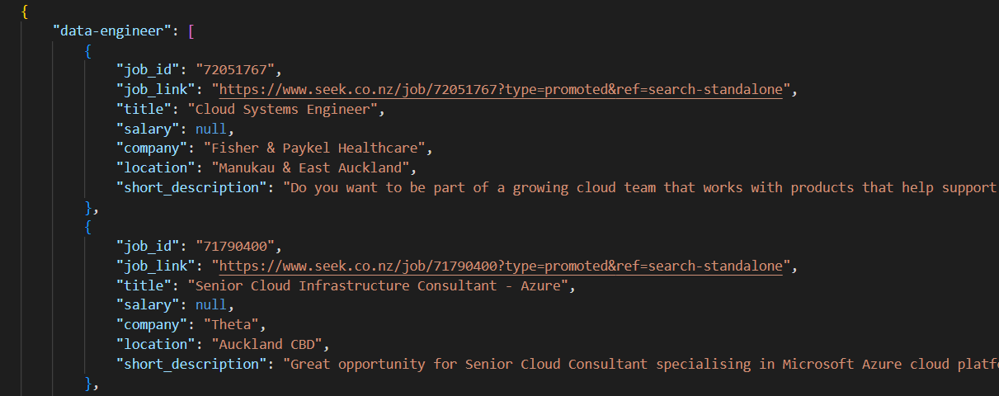

- Developing Tools: Visual Studio 
- Language: Python 3.8 
- Use case: job search 
- Data collected: Job Location, Company, short description, description, Job title, etc.
- Job Site: seek.co.nz
- Description: develop a service or personal used for fun that allows you to read and collect Job Posts of any company, applying filters (company name, specific keywords). 
- sample result refer to [export as json](/job_listing_export.json)
  


## required Pythong libraries 
```py
import requests
from bs4 import BeautifulSoup
import json
```

## scraper return as json format
refer to [listing by json](/return%20as%20json.py)


## scraper return as data frame format
refer to [listing by dataframe](/return%20as%20data%20frame.py.py)